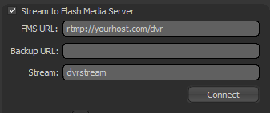
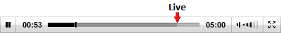

.. _fmsdvr:

======================================================
Flash Media Server: Implementing DVR for the JW Player
======================================================

Version 5.1 of the JW Player supports DVR streams, a feature introduced by Adobe's `Flash Media Interactive Server 3.5 <http://www.adobe.com/products/flashmediaserver/>`_.  To enable DVR streaming on Flash Media Server, you'll need to create a new application, here called "dvr".  (This tutorial assumes the knowledge to install and configure Flash Media Server.  For more info on this, please consult `the Flash Media Server LiveDocs <http://help.adobe.com/en_US/FlashMediaServer/3.5_Deving/WS5b3ccc516d4fbf351e63e3d11a0773d56e-7fee.html>`_).

Setting up the DVR Application
==============================

In the "dvr" application, you'll need to install a single file, called **main.asc**, containing the following code:

.. code-block:: actionscript

	application.onAppStart = function()
	{
		trace("app fme started!");
	};
	 
	application.onConnect = function(p_c)
	{
		this.acceptConnection(p_c);
	};
	 
	application.onPublish = function (p_c, p_stream)
	{
		trace("onPublish stream: "+p_stream.name);
		p_stream.record();
	};
	application.onUnpublish = function(p_c, p_stream)
	{
		trace("onUnpublish stream: "+p_stream.name);
		p_stream.record(false);
	};
	
(Code thanks to `Influxus <http://labs.influxis.com/?p=92>`_, who have an excellent tutorial on building a Flash Media Server DVR application).

Creating a Live DVR Stream
==========================

As of this writing, the only software available off the shelf that allows for DVR-enabled live streaming is Adobe's free `Flash Media Live Encoder <http://www.adobe.com/products/flashmediaserver/flashmediaencoder/>`_.  Make sure the *Stream to Flash Media Server* option is checked, and point the *FMS URL* to your application:

Next, make sure the *DVR Auto Record* option is checked:

Finally, click the *Start* button:

Configuring the JW Player
=========================

Once your DVR-enabled live stream is running, configure your JW Player to connect to it using the *rtmp* provider.  You also need to set the *rtmp.dvr* flashvar to *true*.  The following example uses SWFObject 1.5:

.. code-block:: html

	
	
	
This text will be replaced

	
	
	

Setting the Duration
====================

By default, when using a DVR-enabled live stream, the duration will grow as the stream records more time-shifted content, and the user can seek to the live portion of the stream by scrubbing to the end of it.  The controlbar in this instance looks like it's playing a normal RTMP stream, although the duration constantly updates:

When no duration is set however, the position of the time slider's thumb will jump around slightly, since the duration is updating simultaneously to the position.  To create a smoother user experience, you can set the *duration* flashvar (in seconds), as long as you know the total time a DVR stream will be active.   When *duration* is set, the player's timeline will display the "seekable" area of the stream as a percentage of the total time, with the "recorded" section displayed in a different color:

